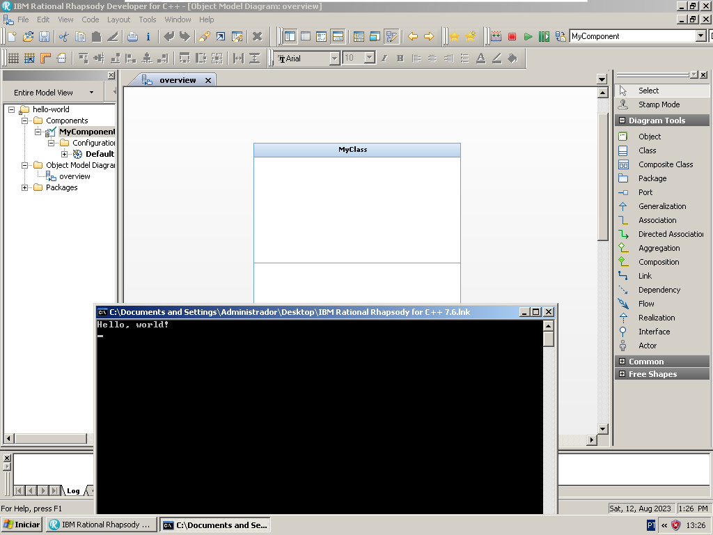

# Hello World em UML

Primeiro projeto feito no Rhapsody. A ideia aqui é simplesmente exibir uma
string na tela.

  

## Informações Adicionais

Na configuração do ambiente, utilizei o MSVC9 (Microsoft Visual C++) no modo de
depuração.

**Versão do Rhapsody**: IBM Rational Rhapsody 7.6 for C++
(build número 2071527).

**Versão do MSVC**: Microsoft Visual Studio 2008 Professional Edition
(trial edition) 9.0.21022.8 RTM.
